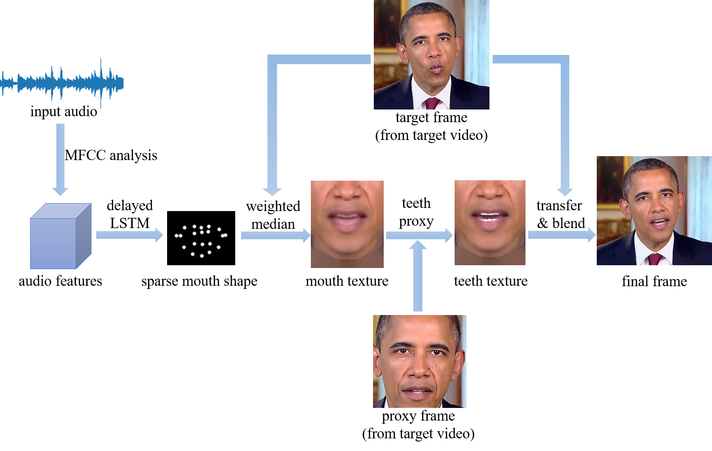
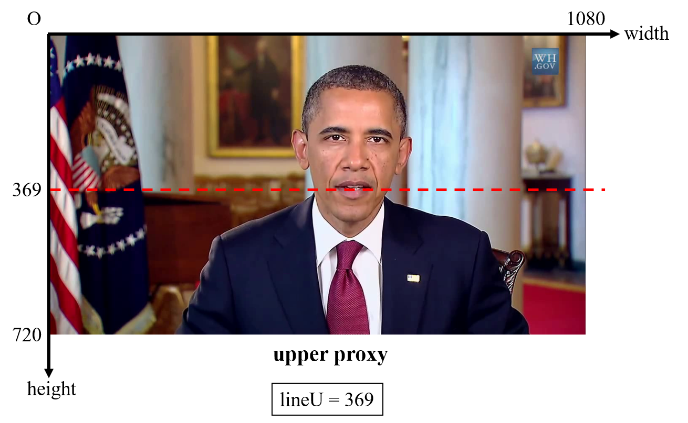
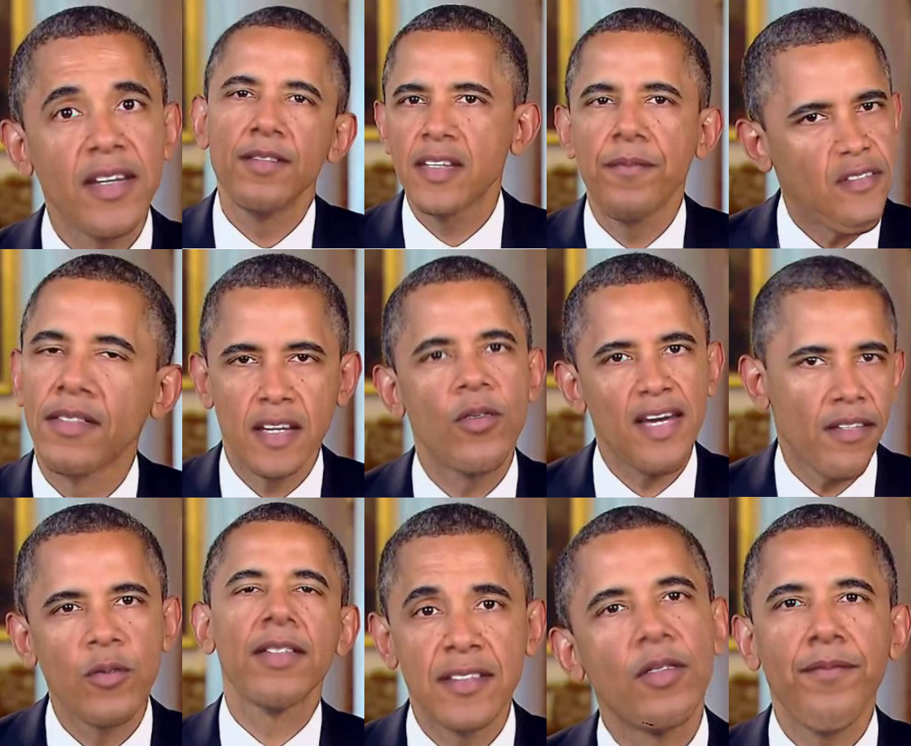

# audio2video
My Undergraduate Graduation Project, the whole pipeline included. 

Given an input audio *A* and a speaker's target video *V*, this project generates an output video where speaker in *V* is saying contents in *A*.

This project is BASICALLY re-implemented from the paper ["Synthesizing Obama: Learning Lip Sync from Audio"](http://grail.cs.washington.edu/projects/AudioToObama/) by [Supasorn Suwajanakorn](https://homes.cs.washington.edu/~supasorn/) et al. They published the LSTM part of codes ([link](https://github.com/supasorn/synthesizing_obama_network_training)) but the whole pipeline cannot be found.

## Architecture & Pipeline

1. Apply MFCC analysis to the input audio, and get the 13-D MFCC coefficients. Combine this 13-D features and log mean energy (volume) as well as their first temporal derivatives to form 28-D vectors as final audio features.
2. An LSTM with delay is used to train and infer the mapping from audio features to sparse mouth shapes which consist of 20 landmark coordinates around speaker's mouth.
3. Given a target video, automatically select candidate frames from it according to similarity to the synthesized sparse mouth shape, and then use pixel-wise weighted median algorithm to generate mouth texture.
4. Manually select proxy frame from target video, and use teeth proxy algorithm to recover details in the teeth region.
5. Re-timing: re-mapping from synthesized mouth & teeth texture sequence to the target frame sequence, in order to make the final speaker's head movement match the input audio and seem natual.
6. For each pair of matched mouth & teeth texture and target frame, transfer and Laplacian pyramid blend synthesized texture onto the target frame to form a final frame. Combine final frame sequence and input audio to get the final speaker's video.

## Dataset
In this project, I use US former president Obama's weekly address as the audio and video dataset. Raw data links and preprocessed data can be found in ```raw/*```.

I use preprocessed audio and video data mentioned above to train the delayed LSTM. For demonstration, I choose audio from this speech: ["Improving Economic Security by Strengthening and Modernizing the Unemployment Insurance System"](https://www.youtube.com/watch?v=6jlaKyvf8WA) as input (saved at ```input/mp3/a015.mp3```) and video from this speech: ["Congress Must Move Forward, Not Back On Wall Street Reform"](https://www.youtube.com/watch?v=6qylcsQjLTA) (saved at ```target/mp4/t187.mp4```) as target, to generate the final output video (saved at ```output/a015-t187/a015-t187_*.mp4```). Of course you can try other data as inputs and targets, even resources other than Obama's weekly address.

## Directory
```
- audio2video/      source codes of this project
- raw/
    - links.txt     Obama's weekly address links
    - mfcc/         features of raw audios
    - fids/         sparse mouth shapes of raw videos
- input/
    - mp3/          input audios
    - mfcc/         features of input audios
    - ldmk/         synthesized sparse mouth shapes of input audio
    - visual/       visualize data in ldmk/*
- target/
    - mp4/          target videos
    - proxy/        proxy frames selected for teeth enhancement
- reference/        some auxiliary data that will be used in the program
- train/            delayed LSTM training outputs
- log/              set for tensorboard
- output/           temporary and final outputs
```

## How to Run
There are totally 5 steps in this project, and you can run the codes step by step or run several continuous steps in one time:
- Step 0: dataset (pipeline #1)
- Step 1: lipsyn (pipeline #2)
- Step 2: lfacesyn (pipeline #3 & #4)
- Step 3: retiming (pipeline #5)
- Step 4: composite (pipeline #6)

#### About step 0
It is advised that you SKIP step 0, because I already publish the preprocessed data in ```raw/fids/*``` and ```raw/mfcc/*```. If you insist to run step 0, it's also OK but it will take dozens of hours. Here is the command line running step 0:
```
python run.py --steps 0 --nthreads <number of threads>
```

#### Run the Demo
You can run step 1 to step 4 in one time:
```
python run.py --steps 1 2 3 4 --pass_id std_u --inp_id a015 --tar_id t187 --lineU 369 --lineL 369
```
You can also run the codes step by step:
```
python run.py --steps 1 --pass_id std_u --inp_id a015 --train True --predict True
python run.py --steps 2 --pass_id std_u --inp_id a015 --tar_id t187 --lineU 369 --lineL 369
python run.py --steps 3 --inp_id a015 --tar_id t187
python run.py --steps 4 --inp_id a015 --tar_id t187 --retiming True
```

#### DIY Instructions
- If you want to tune hyper-parameters of LSTM or change the network, please specify arguments by yourself (see ```options.py```) and remember to use another ```pass_id```.
- If you want to use another input audio, put the mp3 file into ```input/mp3/*``` directory and use the file name as the value of argument ```inp_id```.
- If you want to use another target video, put the mp4 file into ```target/mp4/*``` directory and use the file name as the value of argument ```tar_id```. Moreover, manually select two frames from your target video as the upper and lower teeth proxy, and put them into ```target/proxy/*``` directory. Name the two frames ```<tar_id>_upper*.png``` and ```<tar_id>_lower*.png```. To specify the arguments ```lineU``` and ```lineL```, you need to find the height of horizontal line dividing upper and lower teeth region in the proxy frames. Below is an illustration of ```lineU```.

**(RUNNING STEP BY STEP IS HIGHLY RECOMMENDED IF YOU USE A BRAND NEW TARGET VIDEO!!!)**
- If you want to generate non-retiming version of output video, you can set the argument ```retiming``` to be False.

## Result Conclusion
Here are some frames in my demo output video.


The experimental results show that the LSTM network with delay can well learn how to map audio features to sparse mouth shapes. Moreover, the final output video basically achieves the synchronicity of mouth shape and speech audio, the clarity and verisimilitude of texture, and the coordination of head movement and voice, yet the temporal smoothness needs improving.